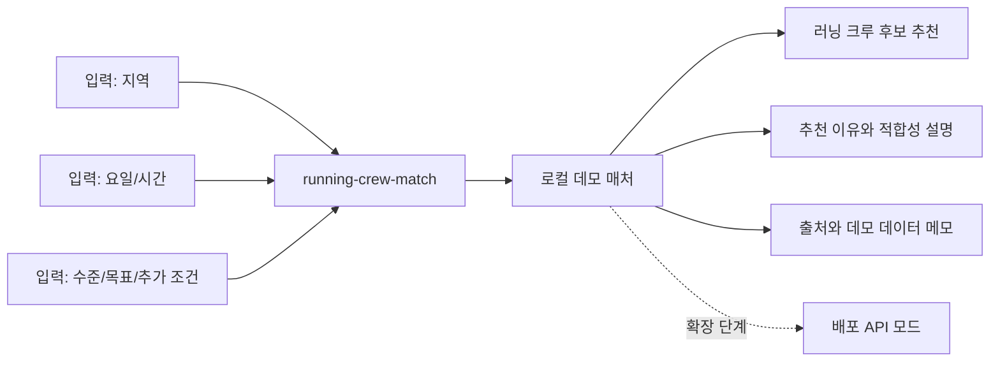

# Skillathon

이 저장소는 **2026년 5월 16일** 행사 **"비개발자도 할 수 있는 AI 업무 자동화 MeetUp&Skillathon"** 을 바탕으로 준비한 프로젝트입니다.

이번 밋업은 비개발자도 직접 시도해볼 수 있는 실용적인 AI 자동화, Codex 기반 스킬 제작, 그리고 OpenClaw·NVIDIA NemoClaw 같은 더 강력한 에이전트 워크플로우를 경험하는 데 초점이 있었습니다. 이 저장소는 그런 맥락에서 만든 개인 Skillathon 작업 저장소이자 제출용 데모 프로젝트입니다.

## 프로젝트 소개

이 저장소의 핵심 프로젝트는 `running-crew-match` 입니다.  
이 스킬은 아래 조건을 바탕으로 한국의 러닝 크루 후보를 추천하는 데모 스킬입니다.

- 지역
- 선호 요일과 시간대
- 러닝 수준
- 러닝 목표
- 소규모 선호, 여성 친화 분위기 같은 추가 조건

현재 버전은 문서만 있는 스킬이 아니라, **직접 실행해볼 수 있는 데모 스킬** 형태로 구성되어 있습니다.



`running-crew-match`가 입력 조건을 받아 추천 결과를 만드는 흐름을 한눈에 보여주는 다이어그램입니다.

## 포함된 구성

- `running-crew-match/SKILL.md`
  스킬 정의와 동작 규칙이 담긴 핵심 문서
- `running-crew-match/assets/demo_crews.json`
  오프라인 테스트용 데모 러닝 크루 데이터
- `running-crew-match/scripts/match_running_crews.py`
  빠르게 실행해볼 수 있는 로컬 CLI 진입점
- `running-crew-match/scripts/dev_server.py`
  데모 및 배포용 로컬 HTTP API 서버
- `running-crew-match/references/usage-guide.md`
  실행 방법을 단계별로 설명한 가이드 문서
- `running-crew-match/references/api-contract.md`
  데모 API의 요청/응답 형식을 정리한 문서
- `running-crew-match/references/test-scenarios.md`
  예시 프롬프트와 기대 동작을 정리한 테스트 시나리오

## 빠른 실행

로컬 매처 실행:

```bash
cd /Users/jisu/Desktop/Skillathon/running-crew-match
python3 scripts/match_running_crews.py \
  --region "성수" \
  --day "평일" \
  --time "저녁" \
  --level "초보" \
  --goal "친목" \
  --notes "소규모" \
  --limit 3 \
  --json
```

로컬 API 서버 실행:

```bash
cd /Users/jisu/Desktop/Skillathon/running-crew-match
python3 scripts/dev_server.py --host 127.0.0.1 --port 8000
```

더 자세한 실행 방법은 아래 문서를 참고하면 됩니다.

- `running-crew-match/references/usage-guide.md`
